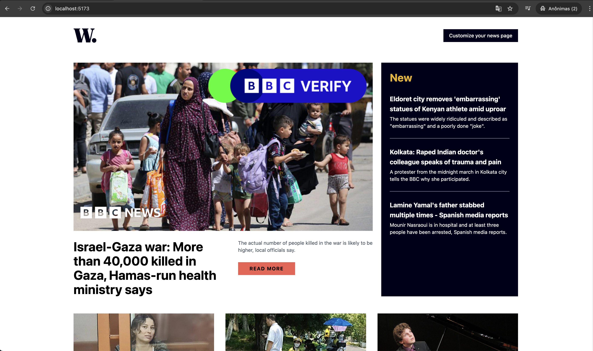
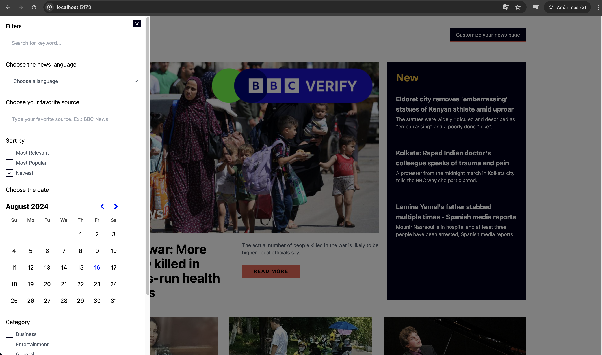

## Innoscripta Front-end Challenge | Pamela Santos
Aplication that shows the forecast according to the geolocation of the browser or if the user doesn't want to active it, the location can be typed by him.

#### APIs
- [News API](https://newsapi.org/)

#### Technologies
- Aplication created with [Vite](https://vitejs.dev/), [React](https://react.dev/) and [TypeScript](https://www.typescriptlang.org/)
- Styling with [Tailwind CSS](https://tailwindcss.com/) and some components from [Radix UI](https://www.radix-ui.com/primitives/docs/overview/introduction)

#### Run the application
- Must have [node](https://nodejs.org/en/) and [Docker](https://www.docker.com/) installed on the computer.
- Clone this repository
- Create a `.env` file with the API key **News API** on this format:

>     VITE_NEWS_API_KEY={#value}

- Run the command `npm install` to install all the dependencies used inside the application
- The project will open in the localhost at the `:5173` after run `npm run dev`
- To build the files for production, you need to run `npm run build` and then run `npm run preview`

#### Run the application with Docker
- Open the Docker app
- Run the command `docker-compose up --build` or `sudo docker-compose up --build`
- You will be able to see the project open in the localhost at the `:8080`
- Stopping the application, type `ctrl + c` and then run `docker-compose stop`

#### Issues / Challenges
- Unfortunately, I only used one data source to create the page. I didn't have time to integrate more than one, but I tried to create as many filters as possible from the News API.
- The layout was inspired in one of the Frontend Mentor challenge, but with more features.
- The application needs a few improvements, such as, the components could be more organized, the filters could be more better worked and I could explore different ways to fetch and customize the homepage news.
